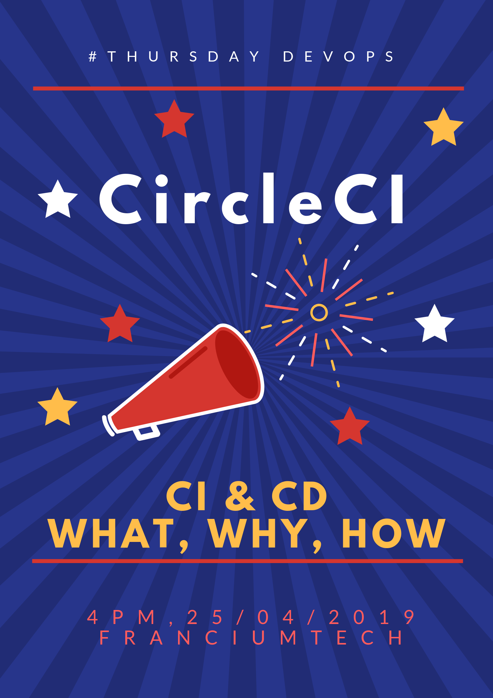

# circleci-session



[](https://github.com/RichardLitt/standard-readme)

> Introduction to CircleCI

```Hello All … If you want to know about Continuous Integration, Continuous Deployment & CircleCI, please come to #29 office tomorrow by 4 PM. We will use CircleCI as an example and see how we can configure a sample rails app to use CI & CD.```

## Table of Contents

  - [Maintainers](#maintainers)
  - [Contributing](#contributing)
  - [License](#license)

## Maintainers

[@worldofprasanna](https://github.com/worldofprasanna)

## Contributing

PRs accepted.

Small note: If editing the README, please conform to the [standard-readme](https://github.com/RichardLitt/standard-readme) specification.

## License

MIT © 2019 Prasanna
