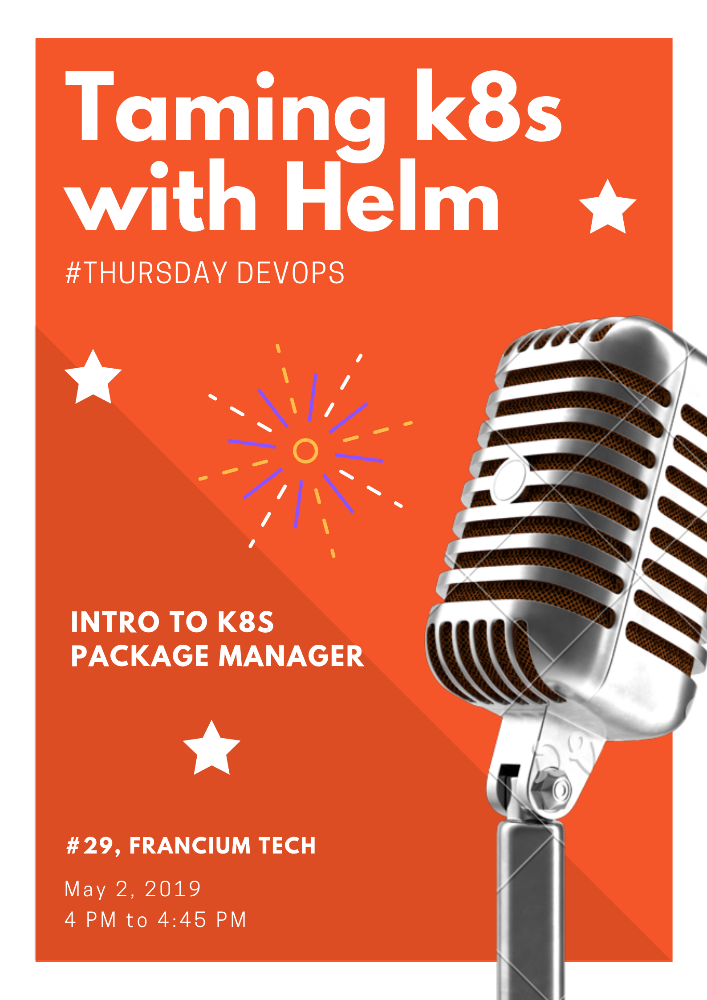

#Taming-k8s-with-helm



[](https://github.com/RichardLitt/standard-readme)

> Taming K8s with Helm

```
Hello All, As part of ThursdayDevops, Archana would be taking a session about Kubernetes package manager and how it helps application deployment in Kubernetes.  If you want to attend please come to #29 office today by 4 PM. 

BTW this is the session she presented in Global Azure Bootcamp.
```

## Table of Contents

  - [Maintainers](#maintainers)
  - [Contributing](#contributing)
  - [License](#license)

## Maintainers

[@worldofprasanna](https://github.com/worldofprasanna)

## Contributing

PRs accepted.

Small note: If editing the README, please conform to the [standard-readme](https://github.com/RichardLitt/standard-readme) specification.

## License

MIT © 2019 Prasanna
